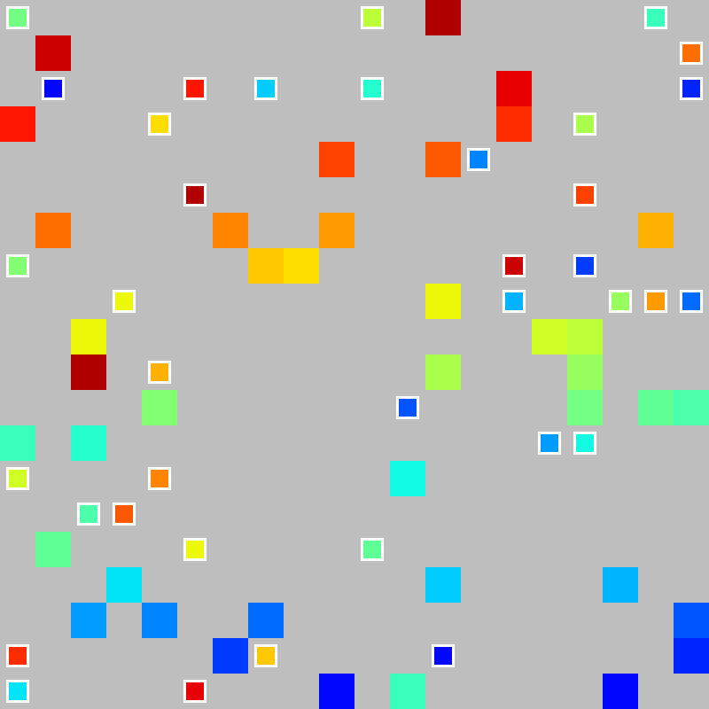

# Implementation of Relational Deep Reinforcement Learning
This Repository is implementation of [Relational Deep Reinforcement Learning](https://arxiv.org/abs/1806.01830) with imitation learning on the Warehouse Environment.

The Reinforcement Learning Algorithm is A2C, but it's very easy to change the base algorithm.
## Requirements
- Python: 3.6.1
- Tensorflow: 1.11.0
- Tensorboard:1.11.0
- OpenAI Gym: 0.15.4
- [stable-baselines](https://github.com/hill-a/stable-baselines), commit hash: 98257ef8c9bd23a24a330731ae54ed086d9ce4a7a1ab7a1c2903e7e1c38756d8cdf7a54a5fd5781e.
    - Already exists in the project, but you need to install the dependencies of stable_baselines


The versions are just what I used and not necessarily strict requirements.

### Install warehouse environment
Go to the `env/warehouse-env/` folder and run the command :
```
python3 setup.py install
```

This will install the warehouse-env environment. Now, you can use this enviroment with the following:
```
from warehouse_env.warehouse_env import WarehouseEnv
import numpy as np
simple_agent = \
         [[ 1,  0,  0,  0,  0,  2, 0],
          [ 0,  0,  0,  0,  0,  0, 0],
          [ 0,  0,  0,  0,  0,  0, 0],
          [ 0,  0,  0,  0,  0,  0, 0],
          [ 0,  0,  0,  0,  0,  0, 0],
          [ 0,  0,  0,  3,  0,  0, 0]]
simple_world = \
         [[  0,  0,  0,  0,  0,  0, 0],
          [  0,  0,  0,  1,  0,  0, 0],
          [  1,  0,  0,  0,  1,  0, 0],
          [  0,  0,  0,  1,  0,  0, 0],
          [  0,  0,  0,  0,  0,  0, 0],
          [  0,  0,  0,  0,  0,  0, 0]]
env = WarehouseEnv(agent_map=np.array(simple_agent), obstacle_map=np.array(simple_world))
```
[More details about the Env](https://github.com/eczy/warehouse-env/blob/pehuen-dev/README.md)

### ODrM* compilation: compile cpp_mstar code
Go to `od_mstar3` folder and run command:
```
python3 setup.py build_ext (may need --inplace as extra argument)
```

Check installation by running:
```
from od_mstar3 import cpp_mstar
```

### Expert Planners 
The following is the example running environment using greedy A* for path planning:


The following is the example running environment using ODrM* for coordinated path planning:


### Install boxworld environment
Go to the `env/gym-box-world` folder and run the command :
```
pip install -e .
```

## How to Run
All training code is contained within ```main.py```. To view options simply run:
```
python3 main.py --help
```

An example:
```
python3 main.py WarehouseEnv RelationalPolicy -model A2CE -save -total_timesteps 2e7 -env_steps 50 -priming_steps 10000 -coordinated_planner
```

An example for running using rendered image observation
```
python3 main.py WarehouseEnv RelationalLstmPolicy -model A2C -save -total_timesteps 2e7 -env_steps 50 -priming_steps 0 -cuda_device 3 -render_as_observation
```

## Experiment result

#### Training Curve


#### Small Environment

##### Single Agent


##### Multiple Agents


#### Big Environment

##### Sparse Environment


##### Dense Environment
